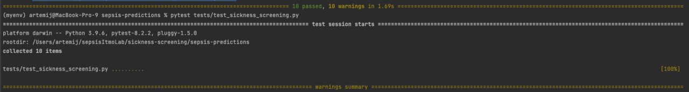

# Модуль Disease-predictions  
[English](sepsis-predictions/README.md)

## Инструкция

Модуль позволяет пользователям взаимодействовать с различными медицинскими таблицами.
Он упрощает агрегацию, балансировку, заполнение пустых значений данных, связанных с конкретным пациентом.
Также позволяет достаточно быстро и просто получить статистики по данным, нормализовать их и обучить на них модель.

### Установка модуля

Чтобы установить модуль, достаточно воспользоваться следующей командой:

```bash
pip install sickness-screening
```
или
```bash
pip3 install sickness-screening
```
### Использование
После импортирования модуля в своем файле появляется возможность взаимодействовать с различными медицинскими данными. 
По умолчанию модуль настроен на набор данных [MIMIC](https://mimic.mit.edu/gettingstarted/cloud/) и предсказание сепсиса. 

## Примеры
### Пример использования библиотеки вы можете посмотреть в [colab](./exampleSepsis.ipynb)
## Тестирование
Библиотека прошла тестирование, сами тесты можно посмотреть [тут](sepsis-predictions/tests/test_sickness_screening.py). 


[//]: # (### Устройство MIMIC)

[//]: # (В примерах разберем, как с помощью модуля sickness-screening обучить модель предсказывать сепсис на наборе данных MIMIC.)

[//]: # (В MIMIC есть множество таблиц, но для примера нам потребуются следующие таблицы:)

[//]: # (1. **chartevents.csv** —— содержит данные мониторинга пациентов, например: температура тела, артериальное давление.)

[//]: # (2. **labevents.csv** —— содержит данные различных анализов пациентов, например различные характеристики анализов крови для пациентов.)

[//]: # (3. **diagnoses.csv** —— содержит информацию о диагнозах, которые получил пациент.)

[//]: # (4. **d_icd_diagnoses** —— расшифрофки кодов диагнозов для каждого диагноза.)

[//]: # (5. **d_labitems.csv** —— расшифрофки кодов анализов для каждого пациента. )

[//]: # ()
[//]: # (#### Аггрегирование данных о диагнозах пациентов:)

[//]: # (Для начала соберем данные о диагнозах пациентов:)

[//]: # (```python)

[//]: # (import sickness_screening as ss)

[//]: # ()
[//]: # (ss.get_diagnoses_data&#40;patient_diagnoses_csv='diagnoses.csv', )

[//]: # (                 all_diagnoses_csv='d_icd_diagnoses.csv',)

[//]: # (                 output_file_csv='gottenDiagnoses.csv'&#41;)

[//]: # (```)

[//]: # (Здесь мы для каждого пациента из **patient_diagnoses_csv** получаем коды диагнозов, а далее, используя **all_diagnoses_csv** )

[//]: # (мы уже получаем файл **output_file_csv** в котором для каждого пациента уже хранится расшифровка его диагноза. )

[//]: # (#### Получение данных о том, есть ли конкретный диагноз у пациента)

[//]: # (```python)

[//]: # (import sickness_screening as ss)

[//]: # (ss.get_diseas_info&#40;diagnoses_csv='gottenDiagnoses.csv', title_column='long_title', diseas_str='sepsis',)

[//]: # (                    diseas_column='has_sepsis', subject_id_column='subject_id', log_stats=True,)

[//]: # (                    output_csv='sepsis_info.csv'&#41;)

[//]: # (```)

[//]: # (Здесь используем таблицу, которую мы получили из предыдущего примера, чтобы на выходе получить таблицу, в которой содержатся данные о том,)

[//]: # (был ли у этого человека в диагнозе продстрока sepsis, или нет. )

[//]: # ()
[//]: # (#### Аггрегирование данных, необходимых для нахождения ССВР &#40;синдром системной воспалительной рекции&#41;)

[//]: # (Теперь соберем некоторые данные, необходимые для определения ССВР:)

[//]: # (```python)

[//]: # (import sickness_screening as ss)

[//]: # ()
[//]: # (ss.get_analyzes_data&#40;analyzes_csv='chartevents.csv', subject_id_col='subject_id', itemid_col='itemid',)

[//]: # (                      charttime_col='charttime', value_col='value', valuenum_col='valuenum',)

[//]: # (                      itemids=[220045, 220210, 223762, 223761, 225651], rest_columns=['Heart rate', 'Respiratory rate', 'Temperature Fahrenheit', 'Temperature Celsius',)

[//]: # (                        'Direct Bilurubin'], output_csv='ssir.csv'&#41;)

[//]: # (```)

[//]: # (Здесь мы используя таблицу **analyzes_csv**, **itemids**&#40;коды анализов, которые мы хотим собрать&#41;, **rest_columns**&#40;колонки, которые мы хотим оставить в выходной таблице&#41;,)

[//]: # (Фунукция собирает из analyzes_csv замеры для пациентов с кодами **itemids** и записать их в **output_csv**, оставив только колонки, которые есть в **rest_columns**)

[//]: # (В данной функции **subject_id_col** и **itemid_col** отвечают за колонки, отведенные под коды пациентов и анализов соответсвенно.)

[//]: # (**charttime_col** отвечает за время. **valuenum_col** отвечает за колонку с единицами измерения анализов. )

[//]: # (#### Комбинирование данных о диагнозах и ССВР)

[//]: # (Теперь скомбинируем данные из предыдущих двух примеров в одну таблицу:)

[//]: # (```python)

[//]: # (import sickness_screening as ss)

[//]: # ()
[//]: # (ss.combine_data&#40;first_data='gottenDiagnoses.csv', )

[//]: # (                              second_data='ssir.csv',)

[//]: # (                              output_file='diagnoses_and_ssir.csv'&#41;)

[//]: # (```)

[//]: # ()
[//]: # (#### Сбор и комбинирование данных об анализах крови, с данными об диагнозах и ССВР)

[//]: # (Соберем данные об анализах крови пациентов и скомбинируем их в одну таблицу:)

[//]: # (```python)

[//]: # (import sickness_screening as ss)

[//]: # ()
[//]: # (ss.merge_and_get_data&#40;merge_with='diagnoses_and_ssir.csv', )

[//]: # (                      blood_csv='labevents.csv',)

[//]: # (                      get_data_from='chartevents.csv',)

[//]: # (                      output_csv='merged_data.csv',)

[//]: # (                      analyzes_names = {)

[//]: # (                        51222: "Hemoglobin",)

[//]: # (                        51279: "Red Blood Cell",)

[//]: # (                        51240: "Large Platelets",)

[//]: # (                        50861: "Alanine Aminotransferase &#40;ALT&#41;",)

[//]: # (                        50878: "Asparate Aminotransferase &#40;AST&#41;",)

[//]: # (                        225651: "Direct Bilirubin",)

[//]: # (                        50867: "Amylase",)

[//]: # (                        51301: "White Blood Cells"}&#41;)

[//]: # (```)

[//]: # (Данная функция ищет данные об **analyzes_names** пациентов из таблиц **blood_csv.csv** и **get_data_from**, )

[//]: # (комбинирует их вместе с **merge_with**. Стоит отметить, что эта функция также комбинирует данные о болезни каждого пациента. )

[//]: # (#### Балансировка данных внутри каждого пациента:)

[//]: # (Сбалансируем данные по общему количеству строк для пациентов с сепсисом и без. )

[//]: # (```python)

[//]: # (import sickness_screening as ss)

[//]: # (ss.balance_on_patients&#40;balancing_csv='merged_data.csv', disease_col='has_sepsis', subject_id_col='subject_id',)

[//]: # (                        output_csv='balance.csv',)

[//]: # (                        output_filtered_csv='balance_filtered.csv',)

[//]: # (                        filtering_on=200,)

[//]: # (                        number_of_patient_selected=50000,)

[//]: # (                        log_stats=True)

[//]: # (                        &#41;)

[//]: # (```)

[//]: # (#### Компрессия данных о каждом пациенте &#40;если в наборе данных пропуски, то внутри каждого пациента пропуски заполнятся значением из этого пациента&#41;)

[//]: # (Теперь заполним пропуски имеющимися данными для каждого пациента, не заполняя статистическими значениями или константами:)

[//]: # (```python)

[//]: # (import sickness_screening as ss)

[//]: # ()
[//]: # (ss.compress&#40;df_to_compress='balanced_data.csv', )

[//]: # (            subject_id_col='subject_id',)

[//]: # (            output_csv='compressed_data.csv'&#41;)

[//]: # ()
[//]: # (```)

[//]: # (#### Выбрать лучших пациентов с данными для балансировки)

[//]: # (```python)

[//]: # (import sickness_screening as ss)

[//]: # ()
[//]: # (ss.choose&#40;compressed_df_csv='compressed_data.csv', )

[//]: # (          output_file='final_balanced_data.csv'&#41;)

[//]: # (```)

[//]: # ()
[//]: # (#### Заполнение пропущенных значений модой)

[//]: # (```python)

[//]: # (import sickness_screening as ss)

[//]: # ()
[//]: # (ss.fill_values&#40;balanced_csv='final_balanced_data.csv', )

[//]: # (               strategy='most_frequent', )

[//]: # (               output_csv='filled_data.csv'&#41;)

[//]: # (```)

[//]: # ()
[//]: # (#### Тренировка модели на наборе данных)

[//]: # (```python)

[//]: # (import sickness_screening as ss)

[//]: # (from sklearn.ensemble import RandomForestClassifier)

[//]: # (from sklearn.preprocessing import MinMaxScaler)

[//]: # (model = ss.train_model&#40;df_to_train_csv='filled_data.csv', )

[//]: # (                       categorical_col=['Large Platelets'], )

[//]: # (                       columns_to_train_on=['Amylase'], )

[//]: # (                       model=RandomForestClassifier&#40;&#41;, )

[//]: # (                       single_cat_column='White Blood Cells', )

[//]: # (                       has_disease_col='has_sepsis', )

[//]: # (                       subject_id_col='subject_id', )

[//]: # (                       valueuom_col='valueuom', )

[//]: # (                       scaler=MinMaxScaler&#40;&#41;, )

[//]: # (                       random_state=42, )

[//]: # (                       test_size=0.2&#41;)

[//]: # (```)

[//]: # (В этой функции мы обучаем **RandomForestClassifier** из scikit-learn на наборе данных с одной категориальной колонкой, с одной числовой колонкой)

[//]: # (и с одной категориальной колонкой, которую можно преобразовать в числовую. В качестве метода нормализации используется **MinMaxScaler** из scikit-learn.)

[//]: # (#### Например, можно вставить такие модели, как CatBoostClassifier или SVC с разными ядрами)

[//]: # (CatBoostClassifier:)

[//]: # (```python)

[//]: # (class_weights = {0: 1, 1: 15})

[//]: # (clf = CatBoostClassifier&#40;loss_function='MultiClassOneVsAll', class_weights=class_weights, iterations=50, learning_rate=0.1, depth=5&#41;)

[//]: # (clf.fit&#40;X_train, y_train&#41;)

[//]: # (```)

[//]: # (SVC с использованием гауссова ядра с радиальной базовой функцией &#40;RBF&#41;:)

[//]: # (```python)

[//]: # (class_weights = {0: 1, 1: 13})

[//]: # (param_dist = {)

[//]: # (    'C': reciprocal&#40;0.1, 100&#41;,)

[//]: # (    'gamma': reciprocal&#40;0.01, 10&#41;,)

[//]: # (    'kernel': ['rbf'])

[//]: # (})

[//]: # ()
[//]: # (svm_model = SVC&#40;class_weight=class_weights, random_state=42&#41;)

[//]: # (random_search = RandomizedSearchCV&#40;)

[//]: # (    svm_model,)

[//]: # (    param_distributions=param_dist,)

[//]: # (    n_iter=10,)

[//]: # (    cv=5,)

[//]: # (    scoring=make_scorer&#40;recall_score, pos_label=1&#41;,)

[//]: # (    n_jobs=-1)

[//]: # (&#41;)

[//]: # (```)

[//]: # ()
[//]: # (### Второй способ &#40;трансформеры TabNet и DeepFM&#41;)

[//]: # (#### Сборка датасета)

[//]: # (С помощью функции process_features можно собрать датасет из признаков. На вход данная функция принимает:)

[//]: # (* файл с признаками, по умолчанию 'chartevents.csv')

[//]: # (* файл, в который будет записан итоговый датасет, по умолчанию 'df.csv')

[//]: # (* список с названиями признаков, по умолчанию ART BP Systolic, HR, RR, Temperature C)

[//]: # (  )
[//]: # (```python)

[//]: # (import sickness_screening as ss)

[//]: # ()
[//]: # (ss.process_features&#40;file_path = 'chartevents.csv', output_path = 'df.csv', item_ids = {)

[//]: # (                        225309: "ART BP Systolic",)

[//]: # (                        220045: "HR",)

[//]: # (                        220210: "RR",)

[//]: # (                        223762: "Temperature C"}&#41;)

[//]: # (```)

[//]: # (Добавляем таргет с помощью функции)

[//]: # (```python)

[//]: # (import sickness_screening as ss)

[//]: # ()
[//]: # (ss.add_diagnosis_column&#40;drgcodes_path = 'drgcodes.csv', feature_path = 'df.csv', output_path = 'df.csv'&#41;)

[//]: # (```)

[//]: # (где:)

[//]: # (* drgcodes_path - файл с диагнозами, по умолчанию 'drgcodes.csv')

[//]: # (* feature_path - наш файл с признаками, по умолчанию 'df.csv')

[//]: # (* output_path - файл, в который будет записан итоговый датасет, по умолчанию 'df.csv')

[//]: # ()
[//]: # (#### Заполнение пропусков)

[//]: # ()
[//]: # (```python)

[//]: # (import sickness_screening as ss)

[//]: # ()
[//]: # (ss.impute_data&#40;input_path = 'df.csv', output_path = 'df.csv', features = {)

[//]: # (                        225309: "ART BP Systolic",)

[//]: # (                        220045: "HR",)

[//]: # (                        220210: "RR",)

[//]: # (                        223762: "Temperature C"}, imputation_method='nona'&#41;)

[//]: # (```)

[//]: # (Эта функция поможет убрать пропуски в датасете с помощью библиотеки NoNa. Данный алгоритм заполняет пропуски различными методами машинного обучения, по умолчанию используется StandardScaler, Ridge и RandomForestClassifier.)

[//]: # ()
[//]: # ()
[//]: # (В качестве imputation_method можно использовать:)

[//]: # (* SimpleImputer)

[//]: # (  - mean)

[//]: # (  - median)

[//]: # (  - most_frequent)

[//]: # (* KNNImputer)

[//]: # (  - knn)

[//]: # (* IterativeImputer)

[//]: # (  - iterative)

[//]: # (* dropna)

[//]: # ()
[//]: # (#### Борьба с дисбалансом классов)

[//]: # ()
[//]: # (```python)

[//]: # (import sickness_screening as ss)

[//]: # ()
[//]: # (ss.resample_data&#40;input_path = 'df.csv', test_size = 0.4, random_state = 42, features = {)

[//]: # (                        225309: "ART BP Systolic",)

[//]: # (                        220045: "HR",)

[//]: # (                        220210: "RR",)

[//]: # (                        223762: "Temperature C"}, target = 'diagnosis', resampled_output_path = 'train_data.csv', test_output_path = 'test_data.csv', resampling_method='SMOTE'&#41;)

[//]: # (```)

[//]: # (На вход данная функция принимает входные и выходные файлы &#40;'df.csv', 'train_data.csv' и 'test_data.csv'&#41;, признаки и целевую переменную.)

[//]: # (По умолчанию используется синтетическое генерирование данных &#40;SMOTE&#41;, но можно выбрать:)

[//]: # (* RandomOverSampler,)

[//]: # (* RandomUnderSampler,)

[//]: # (* ADASYN,)

[//]: # (* SMOTEENN,)

[//]: # (* SMOTETomek.)

[//]: # ()
[//]: # (Дисбаланс классов в тестовых и валидационных данных можно убрать с помощью функции:)

[//]: # (```python)

[//]: # (import sickness_screening as ss)

[//]: # ()
[//]: # (ss.resample_test_val_data&#40;input_path = 'test_data.csv', test_size = 0.4, random_state = 42, features = {)

[//]: # (                        225309: "ART BP Systolic",)

[//]: # (                        220045: "HR",)

[//]: # (                        220210: "RR",)

[//]: # (                        223762: "Temperature C"}, target = 'diagnosis', test_output_path = 'test_data.csv', val_output_path = 'val_data.csv'&#41;)

[//]: # (```)

[//]: # ()
[//]: # (#### Обучение трансформера: TabNet или DeepFM &#40;по умолчанию TabNet&#41;)

[//]: # (TabNet - это архитектура глубокого обучения на основе табличных данных. TabNet применяет последовательные оценки для выбора признаков, которые следует использовать на каждом этапе принятия решения. )

[//]: # (Сначала используем полуконтролируемое предварительное обучение с помощью TabNetPretrainer, а далее создаём и обучаем модель классификации с использованием TabNetClassifier. По умолчанию: )

[//]: # (* learning rate = 0.05,)

[//]: # (* планировщик изменения скорости обучения &#40;learning rate scheduler&#41; - StepLR,)

[//]: # ()
[//]: # ()
[//]: # (Для scheduler также используем: оптимизатор Adam, step_size = 10, gamma = 0.9)

[//]: # (* маскировка sparsemax,)

[//]: # ()
[//]: # (  )
[//]: # (Sparsemax - мягкий максимум, генерирует разреженное распределение, где большинство значений равны 0.)

[//]: # ()
[//]: # (```python)

[//]: # (import sickness_screening as ss)

[//]: # ()
[//]: # (ss.train_model&#40;model_type = 'TabNet', train_path = 'train_data.csv', val_path = 'val_data.csv', feature_importances_path = 'fimp.txt', model_save_path = 'tabnet_model_test', optimizer_params = dict&#40;lr=0.05&#41;, scheduler_params = {)

[//]: # (    "step_size": 10,)

[//]: # (    "gamma": 0.9)

[//]: # (}, pretraining_lr=0.05, training_lr=0.05, mask_type='sparsemax', pretraining_ratio=1.0, max_epochs=200, patience=50, deepfm_params=None&#41;)

[//]: # (```)

[//]: # ()
[//]: # (Можно использовать:)

[//]: # (* в качестве scheduler:)

[//]: # (  - MultiStepLR)

[//]: # (  - ExponentialLR)

[//]: # (  - CosineAnnealingLR)

[//]: # (  - ReduceLROnPlateau)

[//]: # (  - CyclicLR)

[//]: # (  - OneCycleLR)

[//]: # (* в качестве sparsemax:)

[//]: # (  - entmax)

[//]: # (  - softmax)

[//]: # (* в качестве оптимизатора:)

[//]: # (  - Adamax)

[//]: # (  - AdamW)

[//]: # (  - SGD)

[//]: # (  - RMSprop)

[//]: # ()
[//]: # (#### Просмотр метрик)

[//]: # (После обучения модели можно посмотреть точность предсказаний с помощью функции evaluate_tabnet_model:)

[//]: # ()
[//]: # (```python)

[//]: # (import sickness_screening as ss)

[//]: # ()
[//]: # (ss.evaluate_tabnet_model&#40;model_path = 'tabnet_model_test.zip', test_data_path = 'test_data.csv', metrics_output_path = 'metrics.txt'&#41;)

[//]: # (```)

[//]: # ()
[//]: # (### Пример использования библиотеки вы можете посмотреть в [colab]&#40;./exampleSepsis.ipynb&#41;)

[//]: # ()
[//]: # (#### Результаты)

[//]: # (Accuracy = 0.60)

[//]: # ()
[//]: # (Recall = 0.92)

[//]: # ()
[//]: # (#### Была произведена визуализация по 2 PCA компонентам)

[//]: # (![Image alt]&#40;./Визуализация_2_PCA_компоненты.png&#41;)

[//]: # (Распределение по компонентам представлено ниже:)

[//]: # ()
[//]: # (|                  | Нагрузка на первую компоненту | Нагрузка на вторую компоненту |)

[//]: # (| ---------------- | :---: | :---: |)

[//]: # (| Heart rate       |           -0.101450           |            0.991611           |)

[//]: # (| Temperature      |            0.001178           |            0.013098           |)

[//]: # (| Systolic BP      |            0.994771           |            0.100169           |)

[//]: # (| Respiratory rate |            0.011673           |            0.080573           |)

[//]: # (| MEWS             |           -0.000660           |            0.003313           |)

[//]: # ()
[//]: # (Найти закономерностей не получилось.)

[//]: # ()
[//]: # (#### Обучен вариационный кодировщик для построения разделимого 2D пространства.)

[//]: # (![Image alt]&#40;./Вариационный_кодировщик.png&#41;)

[//]: # (Можем заметить, что они накладываются друг на друга и неразделимы.)
